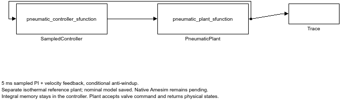

# Controller repair and modular Simulink verification

**Historical stage:** realistic position-only sensing and low-supply protection were added afterward. See [the current upgrade report](SENSING_AND_PROTECTION_UPGRADE.md).

The sampled controller now meets the unchanged acceptance limits in all 15 specified operating cases. Final gains are **Kp=35, Ki=1, Kd=2**, with a 5 ms controller period. Units are 1/m, 1/(m*s), and s/m. This is a synthetic isothermal pneumatic-cylinder simulation with illustrative parameters.

## What was fixed

The earlier gains (40, 2, 2) produced about 2.05 mm extension overshoot in the combined-disturbance case. The revised gains produce **0.449 mm** using the exact original failure seed, below the unchanged 1 mm limit. At the final reporting seed, the before/after result is 2.058 / 0.430 mm.

An initial repair exposed a 1.09 mm overshoot failure in a new 15 ms delay case. That case was explicitly moved into tuning. The first attempt's reports and plot remain in `revision_results/first_attempt/`. The final search evaluated 18 candidates against six known tuning cases, then assessed six regression cases and three new test combinations excluded from gain selection. Previously observed failures are therefore not claimed as held-out evidence.

Limits remain: RMSE ≤4.5 mm over 0.5–5 s; extension and retraction overshoot ≤1 mm; extension settling within ±0.5 mm in ≤0.7 s; late mean absolute error ≤0.5 mm; position stays within stroke. These are project targets, not employer requirements.

## Recorded results

| Case | Split | Extension overshoot (mm) | RMSE (mm) | All limits |
|---|---|---:|---:|---|
| nominal | tuning | 0.146 | 3.789 | Pass |
| heavy | tuning | 0.106 | 3.855 | Pass |
| low_supply | tuning | 0.175 | 4.106 | Pass |
| slow_valve | tuning | 0.338 | 4.192 | Pass |
| combined | tuning | 0.430 | 3.990 | Pass |
| fresh_mixed_b | tuning | 0.426 | 3.849 | Pass |
| high_friction | regression | 0.331 | 3.874 | Pass |
| position_noise | regression | 0.143 | 3.788 | Pass |
| feedback_delay | regression | 0.144 | 3.649 | Pass |
| pressure_drop | regression | 0.146 | 3.787 | Pass |
| fresh_mixed_a | regression | 0.362 | 4.080 | Pass |
| fresh_low_pressure | regression | 0.350 | 4.352 | Pass |
| fresh_delay_mix | fresh_test | 0.413 | 3.999 | Pass |
| fresh_mass_mix | fresh_test | 0.240 | 3.982 | Pass |
| fresh_sensor_mix | fresh_test | 0.306 | 3.784 | Pass |

Five seeds were evaluated for each of the combined case, the earlier 15 ms delay failure, and the three fresh combinations: **25/25 runs passed**. These finite simulated tests do not establish universal robustness. The three step-refinement checks and mass-conservation check passed. See [the machine-readable report](revision_results/report.json) and [gain search](revision_results/search.json).

The tradeoff is slower nominal response: extension settling increased from 0.2805 to 0.3285 s and nominal RMSE from 3.606 to 3.789 mm. Both remain within the fixed limits. Gains were selected for the specified multi-case envelope rather than maximum nominal speed.

## Native Simulink model

`pneumatic_sampled_controller.slx` separates a 5 ms discrete controller from the continuous pneumatic plant. The controller owns integral memory and conditional anti-windup; the plant receives a valve command and returns physical states. The builder's parameter-initialization error was corrected and the saved model was executed.

Nominal and heavy-load traces were cross-checked against Python. Maximum position differences were **0.000293 mm** and **0.000189 mm**, respectively, below the 0.01 mm check threshold. Reports and native MATLAB traces are in `revision_results/`. The native model checks cover these two deterministic cases; the noise/delay/supply-dip suite runs in Python. Its Level-2 MATLAB S-functions are simulation implementations, not generated embedded code.

## Reproduce

Install `requirements.txt`, then run `python controller_revision.py`. Add `matlab/` to the MATLAB path and run `build_modular_controller` with Simulink available. The Python runner regenerates the search, scenario CSVs, seed checks, and plot. The MATLAB builder creates and executes the modular `.slx` and writes comparison reports. Earlier studies remain reproducible through `reference_model.py` and `robustness_study.py`.

## Remaining boundary

The insufficient-supply case still fails: 1.2 bar absolute supply with a 15 N load cannot provide the required actuator authority. It remains recorded as a physical-authority failure and is excluded from the 15 operating-case pass count. It requires a supply/actuator redesign or a restricted operating envelope.

Native Amesim implementation, Amesim/Simulink co-simulation, hardware calibration, realistic velocity sensing, thermal dynamics, and FMI export remain unverified. The modular interface prepares the controller for a future plant replacement; it does not establish Amesim equivalence. Legitimate Amesim access and an actual native model run remain the next role-specific steps.
