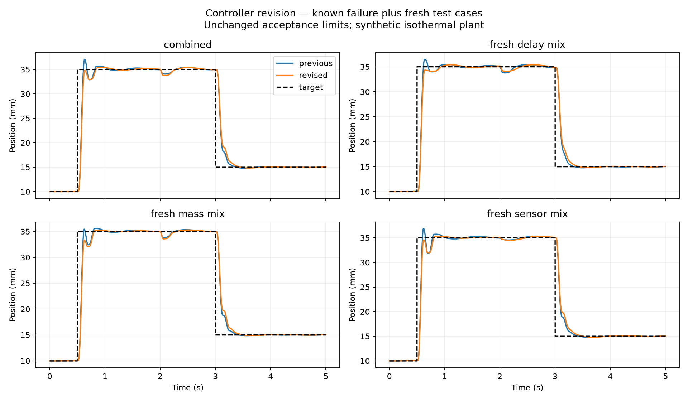
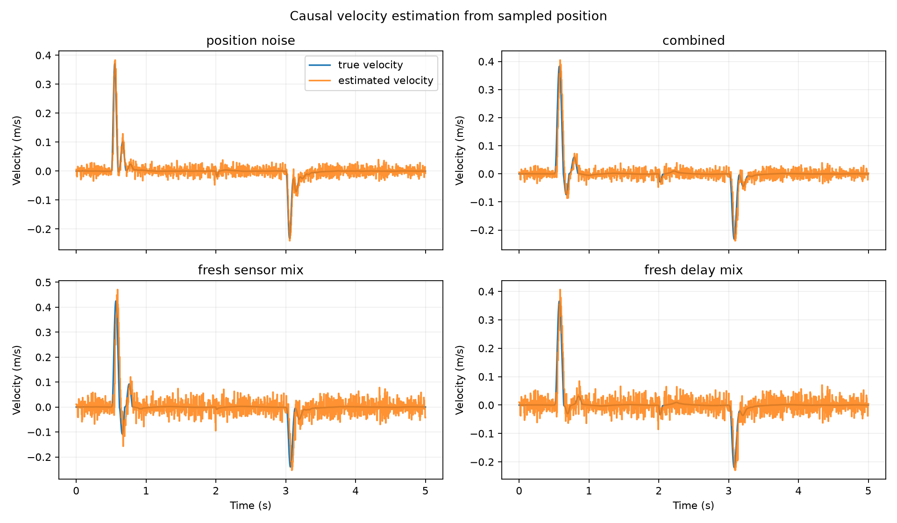
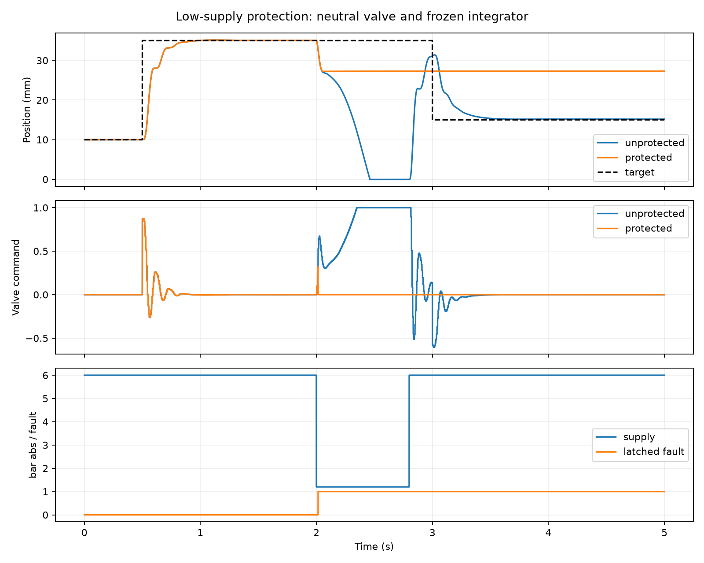
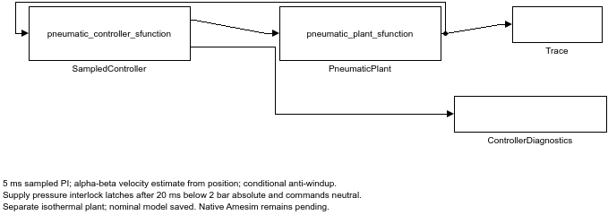
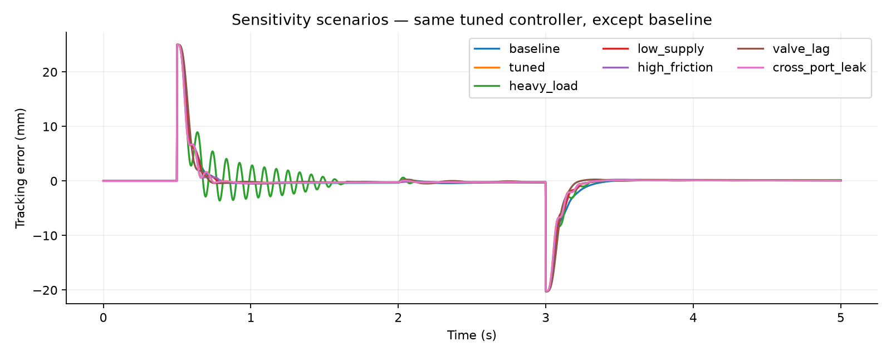

# Pneumatic actuator modeling and position control

An extension of Dewaraj Raparthi's MATLAB soft-robot simulation work, intended to develop evidence for system-simulation engineering. The first stage models a **synthetic double-acting cylinder**, rather than claiming to reproduce the physical telescopic in-pipe robot or a fabricated soft actuator.

## Latest verified version

Read [the sensing and protection upgrade](SENSING_AND_PROTECTION_UPGRADE.md). The controller now estimates velocity from 5 ms position samples and latches a low-supply fault that neutralizes the valve and freezes the integrator. Final gains remain **35, 1, 2**: all 15 specified operating cases and 25 repeated seed runs passed unchanged limits. The upgraded `pneumatic_sampled_controller.slx` matches Python in nominal/heavy checks within 0.0003 mm. Earlier studies below are preserved as history.

## Results at a glance

| Verification item | Recorded result | Status |
|---|---:|:---:|
| Specified operating cases | 15/15 passed | Pass |
| Repeated noise-seed runs | 25/25 passed | Pass |
| Numerical step-refinement checks | 3/3 passed | Pass |
| Global mass-conservation check | Residual within numerical tolerance | Pass |
| Low-supply interlock | Latched at 2.015 s | Pass |
| Python/Simulink nominal position difference | 0.000295 mm maximum | Pass |
| Python/Simulink heavy-load position difference | 0.000263 mm maximum | Pass |

The fixed operating-case limits were RMSE <= 4.5 mm, extension and retraction overshoot <= 1 mm, extension settling within +/-0.5 mm in <= 0.7 s, late mean absolute error <= 0.5 mm, and position within the 0-60 mm stroke.

### Representative final operating cases

| Case | Evaluation split | RMSE (mm) | Extension overshoot (mm) | Result |
|---|---|---:|---:|:---:|
| Nominal | Tuning | 3.770 | 0.140 | Pass |
| Heavy load | Tuning | 3.880 | 0.530 | Pass |
| Combined disturbances | Tuning | 4.000 | 0.600 | Pass |
| Fresh delay combination | Held-out test | 4.010 | 0.450 | Pass |
| Fresh sensor combination | Held-out test | 3.810 | 0.590 | Pass |

Full-precision scenarios, metrics, seeds, and acceptance flags are available in [`upgrade_results/report.json`](upgrade_results/report.json). The values are simulation results for the documented illustrative model, not physical test measurements.

## Results and graphs

### Controller repair across disturbance cases

The final gains were selected for the multi-case operating envelope. The revision reduced the previously failing combined-case extension overshoot from about 2.05 mm to below the fixed 1 mm limit.



### Position-only velocity estimation

The sampled controller receives position every 5 ms. A causal alpha-beta estimator supplies filtered position and velocity estimates; simulated true velocity is retained only for evaluation.



### Low-supply protection

Four consecutive supply-pressure samples below 200 kPa absolute latch the fault, command the closed-center valve to neutral, and freeze the integral state. Protection keeps the piston inside its modeled stroke, although it cannot recover tracking when the pneumatic source lacks sufficient authority.



### Executed Simulink architecture

The final model separates the continuous pneumatic plant from the 5 ms sampled controller, estimator, anti-windup logic, pressure interlock, and diagnostic outputs.



### Plant sensitivity study

The reference study varies load, friction, valve lag, leakage, and supply pressure while keeping the declared controller configuration fixed.



## What is implemented

- Two variable-volume, ideal-gas chambers at a prescribed constant temperature.
- Compressible, bidirectional orifice flow with subsonic and choked regimes.
- Four-way valve routing, first-order spool response, and optional cross-port leakage.
- A piston/load mass, spring, viscous damping, smoothed friction, and penalty end stops.
- Saturated PI position control with conditional anti-windup and a causal alpha-beta velocity estimate from sampled position.
- A debounced, latched low-supply interlock that commands neutral and freezes the integrator.
- Extension and retraction commands, a load disturbance, and sensitivity scenarios.
- Python results, analytical checks, numerical convergence checks, and an independent MATLAB implementation.
- A separate sampled-control robustness study: 36 gain candidates, noise/delay/supply-loss tests, a saturation/anti-windup comparison, and explicit performance failures.

**A native Amesim model and Amesim/Simulink co-simulation are pending licensed access.** `build_simulink_reference.m` builds a native Simulink integration of the MATLAB equations. It does not build or substitute for an Amesim plant.

Recorded verification: Python passed 11 checks; independent MATLAB baseline/tuned comparisons passed; the generated `pneumatic_reference.slx` ran successfully in Simulink and matched the Python position trace within 0.0061 mm. See the JSON reports for precise values and scope.

## Run

Python 3.12 was used for the recorded run. Install packages from `requirements.txt` in your preferred environment and run:

```text
python reference_model.py
python robustness_study.py
python controller_revision.py
python control_upgrade.py
```

Results are written under `results/`, `robustness_results/`, `revision_results/`, and `upgrade_results/`. They include scenario CSVs, parameter definitions, metrics, validation reports, native MATLAB traces, and plots. All numbers are simulations using illustrative parameters, not physical measurements.

For MATLAB, add `matlab/` to the path and run:

```matlab
run_reference
build_simulink_reference
run_robustness
build_modular_controller
```

The MATLAB scripts read the supplied JSON/CSV results and compare traces with Python. The Simulink builders require Simulink and produce the historical `pneumatic_reference.slx` and final `pneumatic_sampled_controller.slx`. Their Level-2 MATLAB S-functions are simulation-only. Inspect `results/` and `upgrade_results/` for the actual cross-check reports.

## Design and interpretation

The default cylinder has a 20 mm bore, an 8 mm rod, a 60 mm stroke, and a 0.4 kg load. Supply pressure is **6 bar absolute**, approximately 5 bar gauge. These values are design choices, not dimensions inferred from an existing prototype. Commanded positions are 10 mm initially, 35 mm at 0.5 s, and 15 mm at 3 s. A 2 N resisting load is applied at 2 s.

The historical continuous-controller comparison uses illustrative baseline gains of Kp=40, Ki=8, Kd=2 and tuned gains of Kp=100, Ki=30, Kd=5. The current sampled controller uses Kp=35, Ki=1, Kd=2 with the alpha-beta estimator and protection logic. Kp is in 1/m, Ki in 1/(m*s), and Kd is in s/m because valve command is dimensionless. These gains were selected for the declared simulation cases and were not calibrated on physical hardware.

Position RMSE is calculated over 0.5–5 s, including the load step and retraction. Settling time uses a ±0.5 mm band after extension and before the disturbance. Null settling time means the response did not remain within that band before the observation window ended. Signed supply mass allows reverse flow; it is not a full compressor energy or efficiency measure.

## Important limitations

Temperature is fixed: no gas-energy equation, heat-transfer model, thermal-efficiency result, or claim of adiabatic-cylinder fidelity. The orifice equation uses ideal-gas nozzle flow with a chosen discharge coefficient; it is not calibrated to a real valve. Smoothed friction does not model true static friction or stick-slip. The end-stop penalty is not an impact/contact validation. The final controller estimates velocity from synthetic noisy/delayed position; it does not identify an actual sensor. The supply interlock assumes an ideal pressure measurement and is not safety-certified. No electrical solenoid circuit, physical identification, hardware validation, Amesim equivalence, FMI export, or production deployment has been established.

The existing `earthwork-inspired-soft-robot/peristaltic.m` uses a prescribed pressure-to-length mapping and displacement/work proxies. This project adds explicit gas mass storage and pressure/force coupling for a conventional cylinder. It is a preparatory subsystem study, not a claim that the old locomotion model has been physically validated or fully replaced.

## Next deliverable

Read [the sensing and protection upgrade](SENSING_AND_PROTECTION_UPGRADE.md) for the current estimator, interlock, tests, and executed Simulink model. [The controller repair report](CONTROLLER_FIX_REPORT.md) and [earlier robustness report](ROBUSTNESS_REPORT.md) preserve the development history. The original `pneumatic_reference.slx` is a continuous historical reference; `pneumatic_sampled_controller.slx` is the current sampled controller with a separate plant.

Follow [the Amesim build guide](AMESIM_BUILD_GUIDE.md), compare equivalent assumptions and parameters, and record the first licensed Amesim run. Only then describe this particular model as completed native Amesim work.
