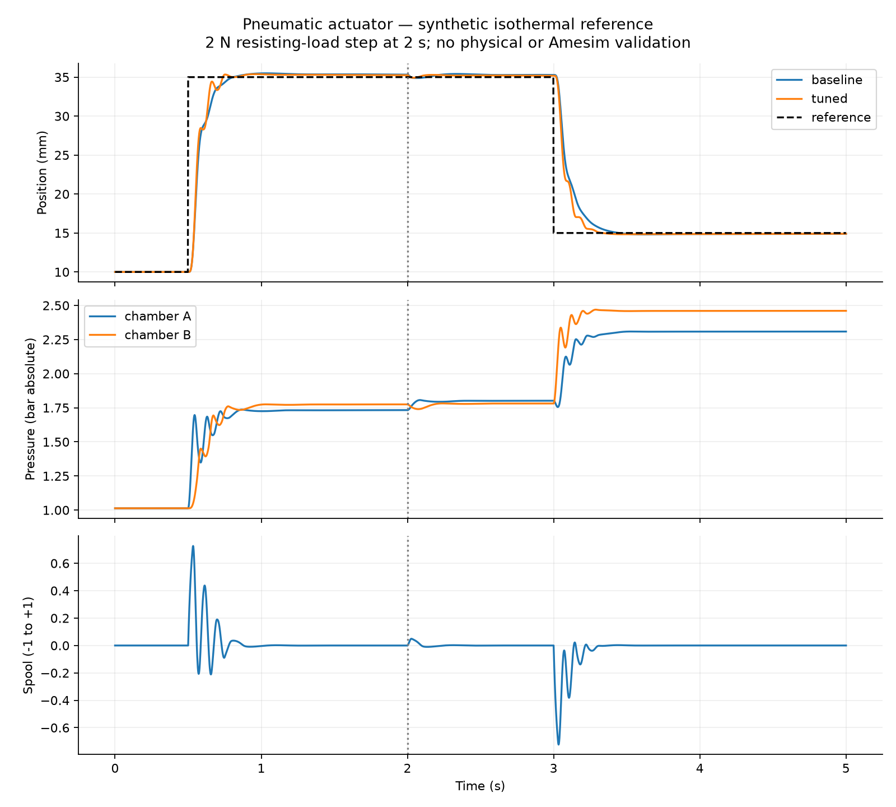

# First-stage simulation results

Prepared for the PROLIM Mechatronic System Simulation Engineer application project. Results are from an illustrative isothermal cylinder model; no physical test or Amesim run has been performed.

## Nominal controller comparison

| Metric | Baseline | Tuned |
|---|---:|---:|
| Position RMSE, 0.5–5 s | 3.686 mm | 3.495 mm |
| Extension settling to ±0.5 mm | 262 ms | 230 ms |
| Extension overshoot before disturbance | 0.490 mm | 0.382 mm |
| Mean absolute error in late evaluation windows | 0.229 mm | 0.177 mm |
| Signed supplied gas over 5 s | 0.0439 g | 0.0582 g |

The tuned gains improve the nominal response, but increase net supplied gas by approximately 32.5%. This is a response/air-consumption tradeoff, not a measured thermal-efficiency improvement. Gains were chosen for this illustrative system and are not globally optimal.

## Fixed-gain sensitivity results

All altered cases keep the tuned controller. The heavy case changes both load mass and resisting force; it is a combined stress case, not an isolated mass study.

| Case | Change | RMSE | Extension overshoot | Settling |
|---|---|---:|---:|---:|
| Nominal tuned | Default parameters | 3.495 mm | 0.382 mm | 230 ms |
| Heavy load | 0.8 kg mass; 5 N load step | 3.811 mm | 3.598 mm | 1124 ms |
| Low supply | 4 bar absolute | 3.706 mm | 0.377 mm | 254 ms |
| High friction | 3 N smoothed Coulomb friction | 3.575 mm | 0.413 mm | 274 ms |
| Valve lag | 75 ms spool time constant | 3.883 mm | 0.403 mm | 208 ms |
| Cross-port leakage | 0.005 mm² effective leakage area | 3.499 mm | 0.390 mm | 230 ms |

The heavy-load case reveals the strongest loss of nominal transient performance. The valve-lag case has worse overall RMSE despite a shorter extension settling metric; no single metric establishes that a controller is better. A next design iteration should specify overshoot/error limits across the stress cases and tune against those limits.

## Verification

The first Python run passed 11 recorded checks in `results/validation.json`. RK45 and tighter-tolerance DOP853 differed by less than 0.000019 mm in nominal position. Global mass-balance residual was approximately 1.7e-19 kg. These results establish implementation and numerical consistency under the tested assumptions, not real-world fidelity.

The independent MATLAB implementation passed for both controllers. Maximum position discrepancy was approximately 0.000000190 mm for baseline and 0.0000150 mm for tuned. The native Simulink `.slx` was generated and executed successfully; its resampled position trace differed from Python by at most 0.00603 mm, below the declared 0.01 mm threshold. See `results/matlab_validation.json` and `results/simulink_validation.json`. The Simulink model integrates the same reference equations through a Level-2 MATLAB S-function; it is not an Amesim co-simulation.

## Remaining engineering work

1. Build the native Amesim pneumatic/mechanical plant with licensed access.
2. Match assumptions or document differences in thermal, valve, and friction models.
3. Compare pressure and position traces with the reference.
4. Evaluate controller performance against explicit multi-scenario acceptance limits.
5. Add a supported Simulink control interface and communication-step study if available.
6. Identify a real actuator and valve, then calibrate and validate with physical measurements if hardware becomes available.

The current project is a useful simulation foundation for the application. It does not yet satisfy the posting's hands-on Amesim requirement.
