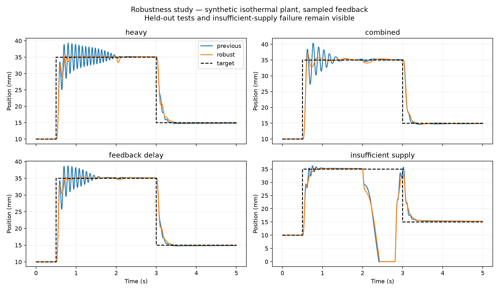
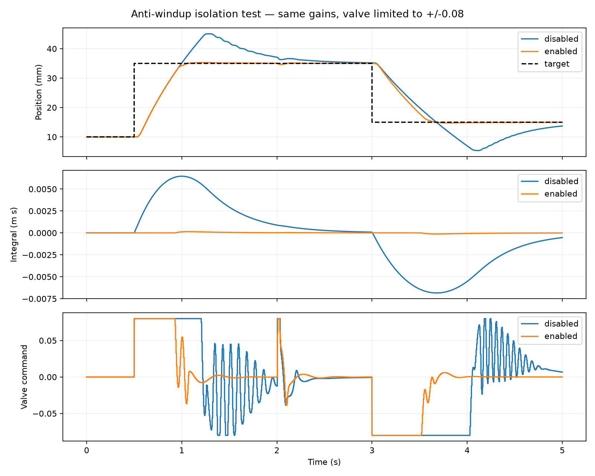
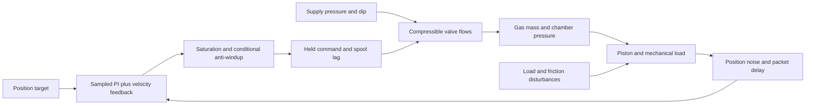

# Sampled-control robustness study

**Historical stage:** the combined-disturbance failure documented here was subsequently repaired. See [the final controller report](CONTROLLER_FIX_REPORT.md) for gains 35, 1, 2 and the revised tests. Results below remain the earlier study.

This is a second-stage study of the synthetic isothermal actuator. It adds a 5 ms controller clock, held valve commands, delayed feedback packets, reproducible position noise, pressure-loss events, and restricted valve command. Results are simulation evidence, not physical validation or Amesim experience.

## Controller selection

A finite search evaluated 36 gain combinations against four tuning cases: nominal, heavy load, low supply, and slow valve. The search was expanded toward lower gains after inspecting failures in the initial training grid. Selection used the worst constraint-penalty score plus 0.1 times the mean score. Test-case results were excluded from the selection objective. No global optimum or statistical robustness guarantee is claimed.

The selected gains are **Kp=40, Ki=2, Kd=2**, compared with the previous Kp=100, Ki=30, Kd=5. Units remain 1/m, 1/(m*s), and s/m, respectively. These gains apply to the new sampled controller; the original continuous MATLAB/Simulink reference remains a separate baseline.

Limits were set before the search and retained: RMSE ≤4.5 mm over 0.5–5 s; extension and retraction overshoot ≤1 mm; extension settling within ±0.5 mm in ≤0.7 s; late-window mean absolute error ≤0.5 mm; no end-stop contact. These are illustrative engineering acceptance targets, not employer-provided or hardware-certified requirements.

## Results

| Case | Split | Previous extension overshoot | Selected extension overshoot | Selected RMSE | Meets all limits? |
|---|---|---:|---:|---:|---|
| Nominal | Tuning | 1.25 mm | 0.19 mm | 3.61 mm | Yes |
| Heavy load | Tuning | 4.32 mm | 0.62 mm | 3.70 mm | Yes |
| Low supply | Tuning | 0.35 mm | 0.23 mm | 3.91 mm | Yes |
| Slow valve | Tuning | 0.59 mm | 0.64 mm | 4.04 mm | Yes |
| High friction | Test | 0.45 mm | 0.37 mm | 3.68 mm | Yes |
| Position noise | Test | 1.21 mm | 0.17 mm | 3.61 mm | Yes |
| Feedback delay | Test | 3.73 mm | 0.20 mm | 3.49 mm | Yes |
| Pressure drop | Test | 1.25 mm | 0.19 mm | 3.60 mm | Yes |
| Combined disturbances | Test | 5.39 mm | 2.05 mm | 3.87 mm | **No: overshoot** |
| Insufficient supply | Failure demonstration | 1.25 mm | 0.19 mm | 12.57 mm | **No: tracking and end-stop contact** |

The selected gains meet all four tuning cases and four of five separate test cases. The combined case improves but still exceeds the 1 mm overshoot target. That failure is preserved rather than hidden or retuned away. Slow-valve overshoot increases slightly, another reason to assess multiple metrics. Stage-one heavy-load overshoot was 3.60 mm with continuous feedback; the like-for-like sampled-controller comparison here starts at 4.32 mm. Those baselines must not be mixed.

## Fault and sensor assumptions

- Position noise: independent Gaussian samples every 5 ms, standard deviation 0.1 mm, fixed seed 20261005. Velocity measurement is ideal; no noisy numerical differentiation is claimed.
- Delay: the complete position/velocity packet is delayed by 10 ms; the initial packet is reused until the history fills. Only delay values divisible by the controller period are supported.
- Pressure drop: supply becomes 2.5 bar absolute from 2.0–2.8 s.
- Combined case: 0.7 kg load mass, 4 N resisting-load step, 2 N smoothed friction, 50 ms valve lag, 0.1 mm position noise, 10 ms feedback delay, and a 3.5 bar absolute supply dip.
- Failure case: a 1.2 bar absolute dip with a 15 N resisting load. The load begins at 2 s and remains afterward; supply recovers at 2.8 s. End-stop contact and large tracking error demonstrate insufficient authority. No protective shutdown controller is implemented.

The position-noise and combined cases are also repeated over five declared seeds in `noise_seed_study`. This provides reproducibility and a small sensitivity check, not a probability-of-failure estimate.

## Anti-windup isolation

A separate experiment limits valve command to ±0.08 and uses Kp=100, Ki=200, Kd=5. These deliberately aggressive gains exercise saturation; they are not the selected robustness controller. Enabling conditional anti-windup is the only change between the two runs.

| Metric | Disabled | Enabled |
|---|---:|---:|
| Extension overshoot | 10.06 mm | 0.30 mm |
| Retraction overshoot | 9.63 mm | 0.25 mm |
| Position RMSE | 8.01 mm | 6.65 mm |
| Maximum absolute integral state | 0.006843 m*s | 0.000149 m*s |
| Fraction of run with saturated command | 36.5% | 19.4% |

Anti-windup strongly improves this isolation test, but **does not meet the 4.5 mm RMSE limit** with the restricted valve. It prevents integral accumulation; it cannot restore missing actuator capacity.

## Verification and reproducibility

Run `python robustness_study.py`. The study writes the full gain-search record, scenario definitions, acceptance results, controller/plant CSV traces, plots, and verification outcomes under `robustness_results/`.

The fast plant RHS matches the original reference equations to numerical precision at four representative times. Five selected scenarios were repeated at 0.25 ms rather than 0.5 ms plant steps; maximum position difference was below 0.001 mm. Mass conservation and actual saturation were checked. Numerical checks passing does not imply that every controller meets performance limits.

The independent sampled MATLAB implementation in `matlab/run_robustness.m` was executed successfully; both nominal/heavy comparisons passed the 0.01 mm position threshold. Actual discrepancies appear in `robustness_results/matlab_validation.json`. MATLAB reuses its independently checked plant equations and disables the original continuous controller. The original `.slx` still represents the continuous baseline, not this sampled robustness study.

## Architecture

## Next work

Build the native Amesim plant after licensed access, reconcile assumptions, and compare exported traces. A useful subsequent controls task is to address the combined-case overshoot with a new training design while reserving a fresh test set. Add physical valve/sensor calibration when actual hardware is available. Do not describe this simulation-only study as field-tested robustness, physical validation, or completed Amesim co-simulation.
